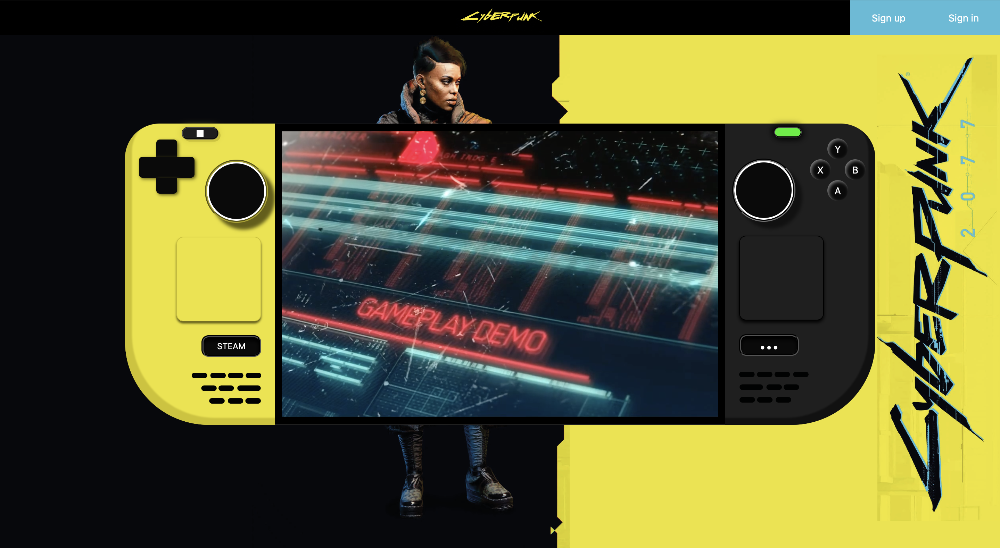

# Primer Proyecto: Videoconsola

  
Contenido 📝

  <ol>
    <li><a href="#objetivo-🎯">Objetivo</a></li>
    <li><a href="#sobre-el-proyecto-🔎">Sobre el proyecto</a></li>
    <li><a href="#vistas">Vistas</a></li>
    <li><a href="#futuras-funcionalidades">Futuras funcionalidades</a></li>
    <li><a href="#contacto">Contacto</a></li>
  </ol>

## Objetivo 🎯

Requeriamos de la reproducción de nuestra Videoconsola favorita a la cual podiamos añadir distintas funcionalidades y dejar volar nuestra imaginación.

## Sobre el proyecto

He decidido recrear la Steam Deck, ya que es una consola la cual la podemos comparar directamente con un ordenador portatil en cuanto a su capacidad como desempeño de videojuegos de alto rendimiento, en este proyecto podremos visualizar las distintas partes que la conforman y concoer los controles antes que nadie del el aclamado videojuego 'Cyberpunk 2077'.

## Vistas

Pagina principal

## Stack

    
    
    
 

## Futuras funcionalidades

✅ Visualizacion del modelo de la consola. 
⬜ Botones informativos: Te indican el nombre y la acción de cada botón en la consola. 
⬜ Mostrar distintos tipos de juegos en la pantalla. 
⬜ ...

## Contacto

